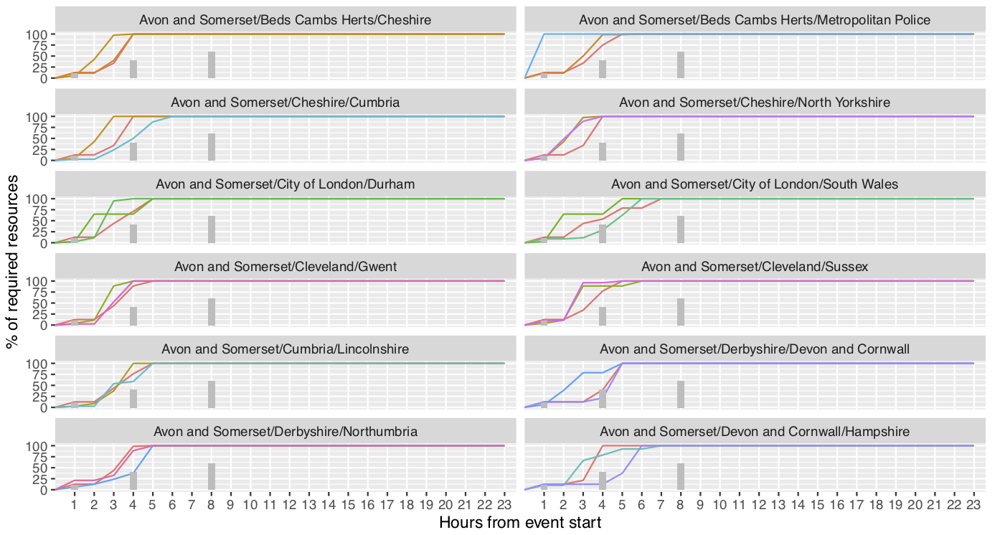

# popm: Public Order Policing Model

[](https://opensource.org/licenses/MIT)
[](https://www.codacy.com?utm_source=github.com&amp;utm_medium=referral&amp;utm_content=M-O-P-D/popm&amp;utm_campaign=Badge_Grade)



## Developer Setup

`popm` is written in python3 and uses the [mesa](https://mesa.readthedocs.io/en/master/) ABM framework with the [mesa-geo](https://github.com/Corvince/mesa-geo) mapping extension for its interactive mode. Use of a virtualenv or similar is recommended, but not essential.

For batch mode, a more efficient (non-mesa) implementation is used that has no explicit timestepping.

NOTE: the police force dataset used (for now) by the model is fictitious, regardless of this it is not stored in the repo in anticipation that the real data will be sensitive.

### Native

Firstly, install dependencies

```bash
pip install -r requirements.txt
```

### Interactive Mode

To run a graphical web-based front end:

```bash
mesa runserver .
```

which automatically opens a browser window

### Batch Mode

#### Running batches

For a non-browser batch run for multiple scenarios and/or more detailed data collection:

```bash
python -m batch_simple <scenario-file>
```

Scenario files are kept in [scenario](./scenario)

Model output files are saved to a named subdirectory of [model-output](./model-output)

As some scenarios contain contain 10000+ runs, batches can be parallelised using MPI (on a suitable platform). On ARC4 use the shell scripts provided, e.g.

```sh
qsub mpi_batch.sh 19-small
```

or for those with only a few possible combinations, just run serially:

```sh
qsub batch.sh 1-large
```

#### Postprocessing batch output

To summarise runs (by force) use e.g.

```
python analysis/by_time.py 19-small-noall
```

which produces output like:

```txt
requirement_frac    mean-0.1 mean-0.4 mean-0.6 mean-1.0
location                                               
Avon and Somerset      3h41m    6h24m    12h5m   17h45m
Beds Cambs Herts        1h0m     8h0m    16h0m   17h35m
Cheshire               1h44m     4h0m    4h44m    16h0m
City of London         1h11m    1h11m    1h11m    16h0m
Cleveland              2h51m    5h51m    5h51m    16h0m
Cumbria                2h50m    5h50m    7h10m   16h40m
Derbyshire             2h15m    5h15m    5h15m    16h0m
Devon and Cornwall      4h0m    4h58m    8h48m   16h38m
Dorset                 2h11m    5h11m    9h11m   18h18m
Durham                 2h59m    5h59m    6h35m   16h24m
...
```

### Troubleshooting

If the dependencies don't install, giving errors like `undefined symbol: Error_GetLastErrorNum` it may be because `mesa-geo` package has an external (non-python) dependency on (e.g.) `libspatialindex-dev` which can be installed with e.g. apt.

## Profiling

(Mesa is not the fastest...)

Install `kcachegrind` and `pyprof2calltree`, then profile using `cProfile` e.g:

```
$ python -m cProfile -o profile.log batch.py scenario/test.json scenario/test.csv
```

And visualise like so:

```
$ pyprof2calltree -k -i profile.log
```

Or just use `pstats` for a simpler text visualisation (without call graphs)

## Data Sources

- Boundary data: [http://geoportal.statistics.gov.uk](http://geoportal.statistics.gov.uk/datasets/police-force-areas-december-2016-ultra-generalised-clipped-boundaries-in-england-and-wales-1?geometry=-22.401%2C48.023%2C18.117%2C57.305)
- Population data (6/2019 is the latest complete dataset): [https://www.ons.gov.uk/peoplepopulationandcommunity/crimeandjustice/datasets/policeforceareadatatables](https://www.ons.gov.uk/peoplepopulationandcommunity/crimeandjustice/datasets/policeforceareadatatables)
