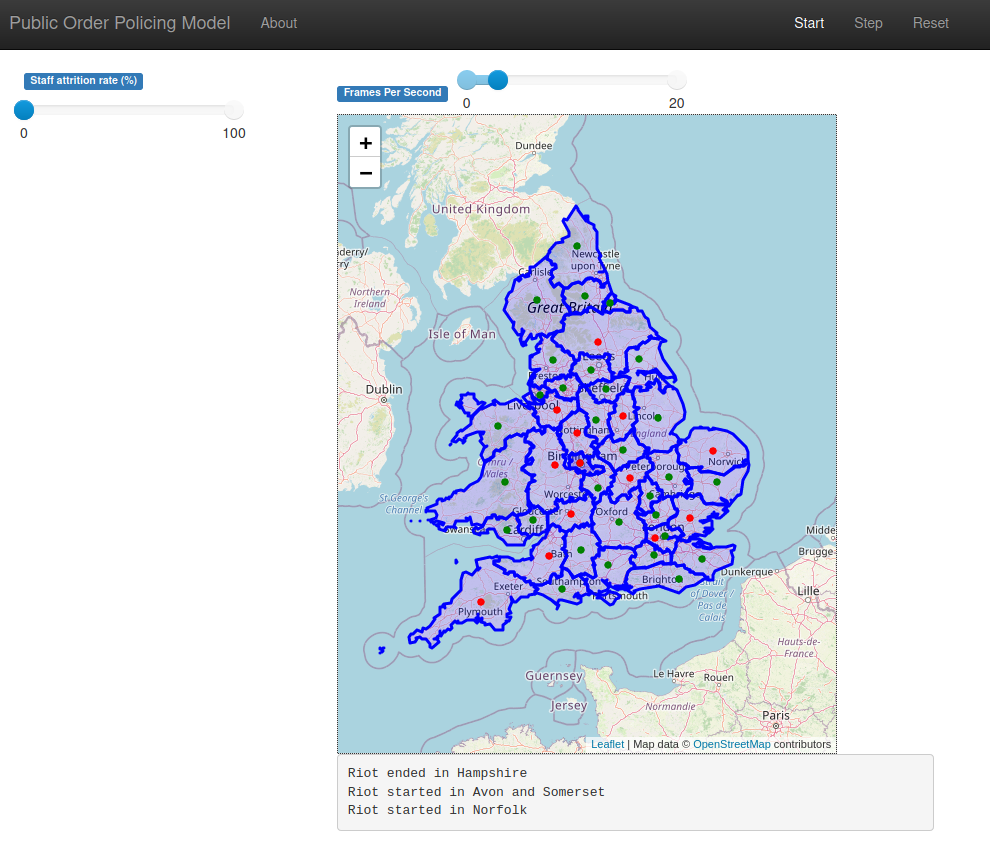

[](https://www.codacy.com?utm_source=github.com&amp;utm_medium=referral&amp;utm_content=M-O-P-D/popm&amp;utm_campaign=Badge_Grade)

# popm: Public Order Policing Model

**[WORK IN PROGRESS]**



## Installation

TODO...

## Developer Setup

popm is written in python3. Use of a virtualenv or similar is recommended, but not essential.

Firstly, install dependencies

```bash
pip install -r requirements.txt
```

Then, run the server:

```bash
mesa runserver .
```

## Deployment

TODO...

# Notes

[MapElement](./popm/visualization/MapElement.py) from MapModule in https://github.com/Corvince/mesa-geo

The mesa-geo package has an external dependency on `libspatialindex-dev` which can be installed with e.g. apt.