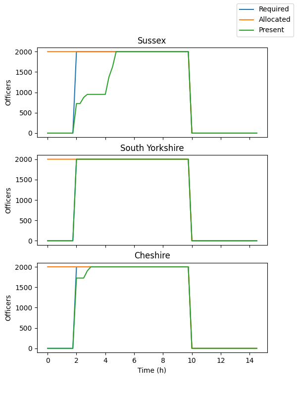

# popm: Public Order Policing Model

[](https://opensource.org/licenses/MIT)
[](https://www.codacy.com?utm_source=github.com&amp;utm_medium=referral&amp;utm_content=M-O-P-D/popm&amp;utm_campaign=Badge_Grade)




## Status

- [X] Initialise available PSUs in each area according to available resources and limits
- [X] Allocate PSUs within event's force area
- [X] Allocate PSUs as necessary from other force areas within alliance
- [X] Allocate PSUs if necessary from force areas outside alliance
- [X] Move PSUs to events
- [X] Return PSUs when events over

popm is deployed as an app service [here](https://popm.azurewebsites.net)

## Developer Setup

`popm` is written in python3 and uses the [mesa](https://mesa.readthedocs.io/en/master/) ABM framework with the [mesa-geo](https://github.com/Corvince/mesa-geo) mapping extension. Use of a virtualenv or similar is recommended, but not essential. A [Dockerfile](./Dockerfile) is provided for containerisation and deployment.

NOTE: the police force dataset used (for now) by the model is fictitious, regardless of this it is not stored in the repo in anticipation that the real data will be sensitive.

### Native

Firstly, install dependencies

```bash
pip install -r requirements.txt
```

### Server Mode

To run a graphical web-based front end:
```bash
mesa runserver .
```
which automatically opens a browser window

### Batch Mode

For a non-graphical batch run for multiple scenarios and/or more detailed data collection: 

```bash
python -m popm.batch <scenario-file> <num_runs>
```

### Docker

See the [Dockerfile](./Dockerfile) which runs in server mode.

e.g.

```bash
docker build -t MOPD/popm .
```

to run on default http port (mapping mesa's default port of 8521 to port 80):

```bash
docker run --rm -d -p 80:8521/tcp mopd/popm:latest
```

to push to the M.O.P.D. repository:

```bash
docker push mopd/popm:latest
```

### Troubleshooting

If the dependencies don't install, giving errors like `undefined symbol: Error_GetLastErrorNum` it may be because `mesa-geo` package has an external (non-python) dependency on (e.g.) `libspatialindex-dev` which can be installed with e.g. apt.

## Deployment

TODO...

## Data Sources

- Boundary data: [http://geoportal.statistics.gov.uk](http://geoportal.statistics.gov.uk/datasets/police-force-areas-december-2016-ultra-generalised-clipped-boundaries-in-england-and-wales-1?geometry=-22.401%2C48.023%2C18.117%2C57.305)
- Population data (6/2019 is the latest complete dataset): [https://www.ons.gov.uk/peoplepopulationandcommunity/crimeandjustice/datasets/policeforceareadatatables](https://www.ons.gov.uk/peoplepopulationandcommunity/crimeandjustice/datasets/policeforceareadatatables)
